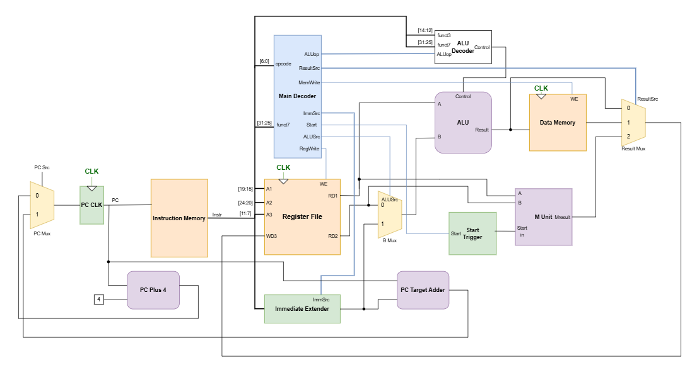
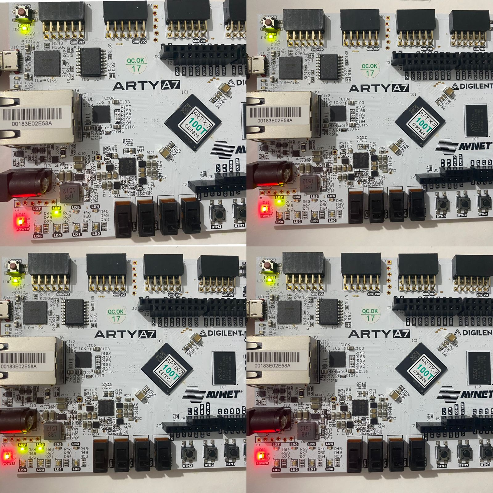
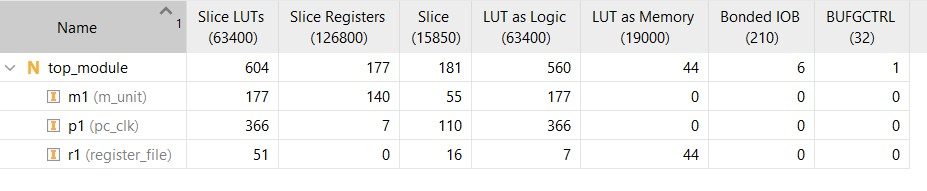
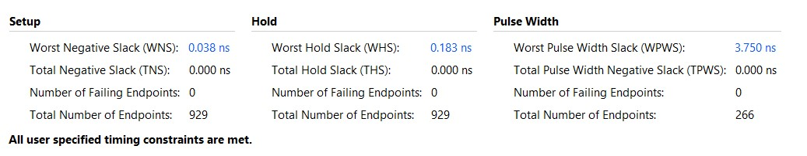
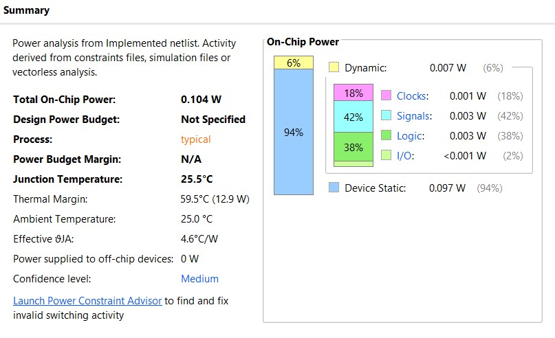

# RISC-V-RV32IM-Processor-Verilog

## Overview

This project implements a **32-bit RISC-V processor (RV32IM)** in Verilog.

- The base **RV32I** instructions execute in a **single cycle**
- The **M-extension (multiply/divide)** executes over **multiple cycles**
- Multicycle behavior is achieved by **stalling the Program Counter (PC)** while the M unit completes

This design keeps the datapath simple while still supporting complex arithmetic operations.


## Architecture Summary

The processor is a **single-cycle datapath** with the following stages:

- Instruction Fetch (IF)
- Decode (ID)
- Execute (EX)
- Memory (MEM)
- Writeback (WB)

All stages complete in one cycle **except M-extension instructions**, which stall the PC and run over multiple cycles.



## Design Approach

- Keep core execution simple (single-cycle)
- Offload complex operations (mul/div) to a separate unit
- Use **PC stalling instead of full multicycle control FSM**

---

### RV32M Instructions (Multicycle)

1. Detect M instruction
2. Trigger MUnit
3. Stall PC
4. Wait for completion
5. Write result
6. Resume execution

Completed in **multiple cycles**

---

## Example Programs & Simulation Results

To validate the processor, two example programs were executed and verified using simulation outputs (register file + data memory).

## Program 1: Sum of First N Numbers

### Assembly Code

```assembly
addi x1, x0, 4      # N = 4
addi x2, x0, 0      # result = 0
addi x3, x0, 0      # i = 0

loop:
add  x2, x2, x3     # result += i
addi x3, x3, 1      # i++
addi x1, x1, -1     # N--
bne  x1, x0, loop

sw x2, 0(x0)        # store result to memory[0]
```

Expected Results :
0 + 1 + 2 + 3 = 6

Register x2 = 6

Memory[0] = 6

.jpg)

---

## Program 2: Sum of Squares upto N

### Assembly Code

```assembly
addi x1, x0, 1      # i = 1
addi x2, x0, 5      # N = 5
addi x3, x0, 1      # intermediate
addi x4, x0, 0      # result = 0

loop:
mul  x3, x1, x1     # intermediate = i * i
add  x4, x4, x3     # result += intermediate
addi x1, x1, 1      # i++
bne  x2, x1, loop

sw x4, 0(x1)        # store result
```
Expected Results :
1^2 + 2^2 + 3^2 + 4^2 = 30

Register x4 = 30

Memory[1] = 30

.jpg)

Note: The assembly program was converted to corresponding hex code and written in the Instruction Memory module of the processor

---

## Key Differences

| Feature          | Sum (Program 1)    | Sum of Squares (Program 2)   |
| ---------------- | ------------------ | ---------------------------- |
| Instruction Type | RV32I only         | RV32I + RV32M                |
| Execution Style  | Fully single-cycle | Hybrid (single + multicycle) |
| PC Stall         | No                 | Yes (during `mul`)           |
| Complexity       | Simple             | Higher due to M-unit         |

## FPGA Implementation
This processor was successfully implemented on the Arty A7 Artix-7 FPGA board and here are the results.

Instructions were given in a mem file and loaded onto the FPGA using readmemh.

LSB 4 bits of the program counter were given as outputs to the on board LEDs.



This sequence of program counter appears 5 times for the program of sum to N number for N=4. First sequence is the set of instructions executing the loading of registers with initial values. The next 4 times is the looping for sum. Executes as per the program counter in simulation waveform.

For the program of sum to N squares, the same type of sequence is observed and 4th state (bottom right) stays for around 35 cycles which denotes that multiplication operation is being performed. This sequence repeats 4 times for sum of squares upto 4.

**Utilisation**



**Timing**



**Power report**


